# AstroContraRag: Geometric Separation of Scientific Contradictions

[](https://www.python.org/downloads/)
[](https://pytorch.org/)
[](https://github.com/facebookresearch/faiss)
[](LICENSE)
[]()

> **Official Implementation of "Geometric Separation of Scientific Contradictions: Mitigating Hallucinations in High-Precision Astro-RAG"**
> *Submitted to 2026 IEEE Space, Aerospace and Defence Conference (SPACE)*

---

## 📋 Abstract

The growing volume of astronomy literature requires efficient synthesis via Retrieval-Augmented Generation (RAG). However, standard dense retrievers often conflate factual claims with contradictory statements that share high lexical overlap (e.g., "Universe is expanding" vs. "Universe is contracting"), leading to hallucinations.

**AstroContraRag** (implementing the **Astro-SparseCL** pipeline) introduces a domain-adapted approach that applies **Hoyer Sparsity** to embedding-difference vectors. This isolates logical negation in a sparse geometric subspace. On a dataset of **107,944 claim-contradiction pairs**, our method achieves **97.8% classification accuracy**. By utilizing an asymmetric dual-index retrieval strategy, we reduce retrieval depth ($K=200 \to 20$), achieving a **12.96× speedup** while maintaining **86.7% robustness** on unseen queries.

---

## 🏗️ Methodology

Our approach follows a four-stage pipeline designed to prevent the retrieval of both distractors and hard negatives in astronomical QA.

```mermaid
graph LR
    A[Mistral-7B] -->|Extracts Claims &<br>Generates Contradictions| B(Data Gen)
    B -->|Triplets| C[Astro-SparseCL Fine-tuning]
    C -->|Hoyer Loss α=5.88| D[Sparse-Aware Encoder]
    D -->|Embeds Corpus| E[Dual-Index FAISS]
    E -->|Asymmetric Retrieval| F[LLM-as-a-Judge Evaluation]
    
    style A fill:#f9f,stroke:#333,stroke-width:2px
    style C fill:#bbf,stroke:#333,stroke-width:2px
    style E fill:#bfb,stroke:#333,stroke-width:2px
```



1. **Atomic Claim Extraction**: Uses Mistral-7B to refine abstracts into self-contained factual claims.
2. **Contradiction Synthesis**: Generates Type-A (Distractors) and Type-B (Hard Negatives/Causal Inversions) contradictions.
3. **Sparse Contrastive Fine-Tuning**: Trains BAAI/bge-base-en-v1.5 using a tailored Hoyer Sparsity Loss to enforce geometric separation.
4. **Dual-Index Retrieval**: Deploys an asymmetric retrieval framework with optimized thresholds for Titles (0.53) and Abstracts (0.87).

---

## 📂 Repository Structure

```
ASTROCONTRARAG/
├── run.py                      # Main entry point for the pipeline
├── downloder.py                # Utility to download the Pathfinder arXiv dataset
├── requirements.txt            # Python dependencies
├── README.md                   # (This file)
├── LICENSE                     # MIT License
│
├── csv/                        # Generated datasets and results
│   ├── dataset.csv             # Processed claim-contradiction pairs
│   ├── hyperparameter_mixed_results.csv  # Grid search results
│   └── intermediate_candidates.csv       # Intermediate training data
│
├── sparse/                     # [MODULE 1 & 2] Data Generation & Training
│   ├── datasetmaker.py         # Uses Mistral-7B to extract claims & generate contradictions
│   ├── dcombiner.py            # Data utility to merge datasets
│   ├── finetune.py             # Fine-tunes BAAI/bge-base-en-v1.5 with Hoyer Loss
│   ├── plot.py                 # Training metric visualization
│   ├── test_sparse.py          # Unit tests for sparsity constraints
│   └── test_sparse_hyperparameter.md  # Documentation for sparsity hyperparameters
│
├── Faiss/                      # [MODULE 3] Retrieval System
│   ├── encode.py               # Encodes corpus into dense/sparse vectors
│   ├── hyperparameter_of_retrieval.py  # Grid search for Title/Abstract thresholds
│   └── hyperparameter_of_retrieval.md  # Documentation for retrieval hyperparameters
│
├── testing/                    # [MODULE 4] Evaluation
│   ├── evaluate_llm.py         # LLM-as-a-Judge validation (Llama-3.1-8B)
│   ├── evaluate_csv.py         # Standard metrics (Recall, Accuracy)
│   ├── test_data_creater.py    # Generates synthetic test queries
│   └── accuracy.md             # Documentation for evaluation metrics
│
├── Relevant_Images/            # Generated visualizations and diagrams
│
└── Visualisation Codes/        # Reproduction of Paper Figures
    ├── Alpha Optimization Curve.ipynb         # Figure 3: Optimal Alpha (5.88)
    ├── Cosine vs. Hoyer Distribution.ipynb    # Figure 2: Geometric Separation
    ├── Dual-Index Heatmap.ipynb               # Figure 4: Recall Landscape
    ├── Retrieval-Efficiency-Tradeoff.ipynb    # Figure 5: Efficiency vs. Effectiveness
    └── LLM Validation Results.ipynb           # Figure 6: Robustness Analysis
```

---

## ⚙️ Installation

### Prerequisites
- Python 3.10+
- CUDA-enabled GPU (Minimum 1x NVIDIA RTX 3090 recommended for training)
- 16GB+ RAM

### Setup

1. **Clone the repository:**
   ```bash
   git clone https://github.com/SamratRay2005/AstroContraRag.git
   cd AstroContraRag
   ```

2. **Install dependencies:**
   ```bash
   pip install -r requirements.txt
   ```

3. **Download the Pathfinder arXiv dataset:**
   ```bash
   python downloder.py --dataset kiyer/pathfinder_arxiv_data
   ```

---

## 🚀 Usage Guide

### Step 1: Data Generation

Extract atomic claims and generate Type-B hard negatives.

> **Note:** Configuration (overlap thresholds) is managed in the `CONFIG` block at the top of `sparse/datasetmaker.py`.

```bash
python sparse/datasetmaker.py
```

### Step 2: Fine-Tuning (Astro-SparseCL)

Train the bi-encoder using the Hoyer Sparsity Loss.

> **Note:** Hyperparameters (Alpha=5.88, Epochs=3) are set in the `Config` class within `sparse/finetune.py`.

```bash
python sparse/finetune.py
```

### Step 3: Indexing & Retrieval

Encode the corpus and build the dual FAISS indices.

> **Note:** This script automatically applies the asymmetric thresholds (**0.87** for Abstracts, **0.53** for Titles).

```bash
python Faiss/encode.py
```

### Step 4: Evaluation Pipeline

This is a two-stage process. First, generate the retrieval candidates, then validate them with the LLM.

**A. Generate Candidate CSV**
Run standard retrieval on the test set to create `intermediate_candidates.csv`.

```bash
python testing/evaluate_csv.py
```

**B. Run LLM-as-a-Judge**
Validate the contradictions using Llama-3.1-8B.

> **Note:** This script processes the `intermediate_candidates.csv` file generated in the previous step. To limit the number of queries, modify the loop in `evaluate_llm.py` directly.

```bash
python testing/evaluate_llm.py
```

---

## 📊 Key Results

| Metric                          | Astro-SparseCL        | Description                           |
|---------------------------------|-----------------------|---------------------------------------|
| Classification Accuracy         | **97.8%**             | Separates contradictions from claims  |
| Optimal Sparsity ($\alpha$)     | **5.88**              | Balanced semantic/geometric loss      |
| Retrieval Depth ($K$)           | **20**                | 90% Reduction in candidate processing |
| Inference Speedup               | **12.96×**            | Low-latency deployment                |
| Robustness (Unseen Queries)     | **86.7%**             | Validated on 2,336 novel queries      |

---

## 🔬 Reproducibility

To reproduce the figures and results from the paper, navigate to the `Visualisation Codes/` directory and run the corresponding Jupyter notebooks:

```bash
cd "Visualisation Codes"
jupyter notebook
```

### Paper Figures Mapping:
- **Figure 2** (Geometric Separation): `Cosine vs. Hoyer Distribution.ipynb`
- **Figure 3** (Optimal Alpha): `Alpha Optimization Curve.ipynb`
- **Figure 4** (Recall Landscape): `Dual-Index Heatmap.ipynb`
- **Figure 5** (Efficiency Tradeoff): `Retrieval-Efficiency-Tradeoff.ipynb`
- **Figure 6** (LLM Validation): `LLM Validation Results.ipynb`

---

## 🧪 Testing

Run unit tests for sparsity constraints:

```bash
python sparse/test_sparse.py
```

Generate synthetic test queries:

```bash
python testing/test_data_creater.py
```

---

## 🛠️ Key Components

### Hoyer Sparsity Loss

The core innovation is the Hoyer Sparsity Loss, which promotes orthogonality between contradictory embeddings:

$$
\mathcal{L}_{\text{total}} = \mathcal{L}_{\text{contrastive}} + \alpha \cdot \mathcal{L}_{\text{Hoyer}}
$$

Where:
- $\mathcal{L}_{\text{contrastive}}$: Standard contrastive loss (InfoNCE)
- $\mathcal{L}_{\text{Hoyer}}$: Hoyer sparsity regularization on embedding-difference vectors
- $\alpha = 5.88$: Optimized sparsity weight

### Dual-Index Retrieval Strategy

- **Title Index**: Threshold = 0.53 (high recall, captures broad topics)
- **Abstract Index**: Threshold = 0.87 (high precision, filters contradictions)
- **Asymmetric Design**: Balances efficiency and accuracy by prioritizing high-precision abstract matching

---

## 📖 Citation

If you use this code or methodology in your research, please cite our submission:

```bibtex
@unpublished{ray2026astrocontrarag,
  title={Geometric Separation of Scientific Contradictions: Mitigating Hallucinations in High-Precision Astro-RAG},
  author={Ray, Samrat and Kulkarni, Ranjeet and Sen, Snigdha and Chakraborty, Pavan},
  note={Submitted to IEEE Space, Aerospace and Defence Conference (SPACE). Submitted: Jan 30, 2026},
  year={2026},
  month={January},
  pages={1--6},
  organization={IIIT Allahabad & Manipal Institute of Technology}
}
```

---

## 👥 Authors & Affiliations

- **Samrat Ray** - Dept. of Information Technology, IIIT Allahabad
- **Ranjeet Kulkarni** - Dept. of Information Technology, IIIT Allahabad
- **Snigdha Sen** - Manipal Institute of Technology, MAHE
- **Pavan Chakraborty** - Dept. of Information Technology, IIIT Allahabad

---

## 📜 License

This project is licensed under the MIT License - see the [LICENSE](LICENSE) file for details.

---

## 🤝 Contributing

Contributions are welcome! Please open an issue or submit a pull request for any improvements or bug fixes.

---

## 📧 Contact

For questions or collaborations, please contact:
- **Samrat Ray** (IIIT Allahabad): iit2023066@iiita.ac.in
- **Ranjeet Kulkarni** (IIIT Allahabad): iit2023064@iiita.ac.in
- **Snigdha Sen** (Manipal Institute of Technology): snigdha.sen@manipal.edu
- **GitHub Issues**: [Open an Issue](https://github.com/SamratRay2005/AstroContraRag/issues)

---

## 🙏 Acknowledgments

- **Pathfinder arXiv Dataset**: Astronomy research papers corpus
- **BAAI/bge-base-en-v1.5**: Base embedding model
- **Mistral-7B**: Claim extraction and contradiction generation
- **Llama-3.1-8B**: LLM-as-a-Judge validation

---

**⚡ Built with PyTorch, FAISS, and a passion for reliable scientific AI.**
